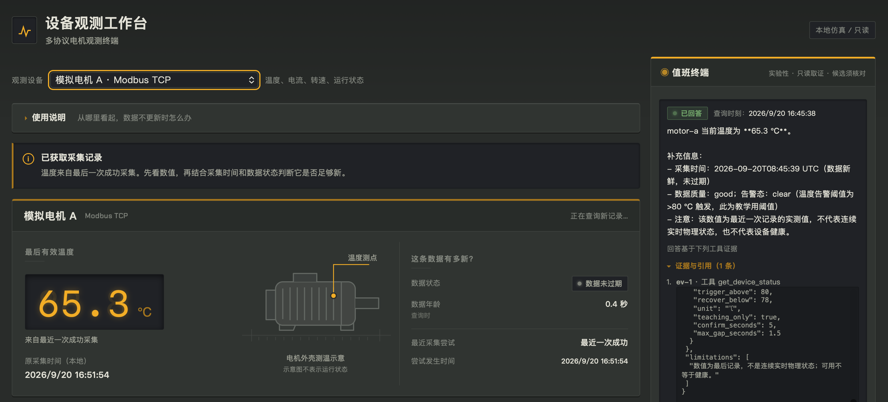
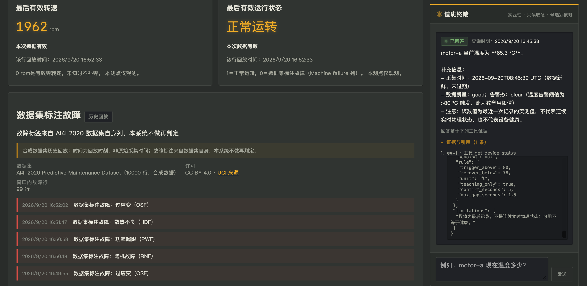
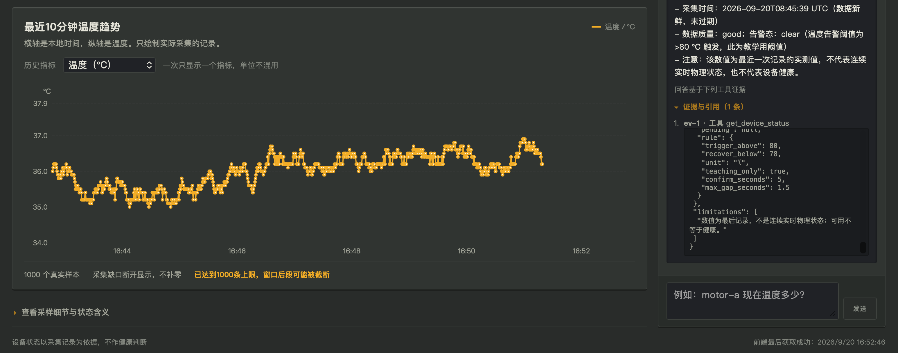

# 工业设备智能运维：从两条工业协议到一个只读智能助手

个人学习作品：以"把一台设备看清楚"为目标，从零实现 Modbus TCP 与 OPC UA 两种主流工业协议的采集链路，落成一个不伪造数据的监控看板，并在严格的只读边界内叠加一个带证据引用的 AI 运维助手。

| Modbus 仿真电机 + 值班终端问答 | AI4I 2020 数据集回放：故障史 | 数据集回放：温度趋势 |
| --- | --- | --- |
|  |  |  |

## 我想探索的问题

- **Modbus TCP**：无符号 16 位保持寄存器如何变成一个带单位的物理量（653 × 0.1 = 65.3℃）？轮询采集、四测点批量读取、通信失败与数据校验失败如何分开记录？
- **OPC UA**：订阅推送和周期读取各适合什么场景？质量码（Good/Bad）、源时间戳、重复与倒退的测量为什么必须拒收，而不是"补一个新样本"？
- **数据诚实性**：曲线缺口不补零、不插值；数据过期就说过期；页面刷新不会翻倍采集；停线不冒充在线。这套原则贯穿采集、存储、API 和前端。
- **历史数据接入**：企业里最常见的运维数据形态是历史批次/回放，不是实时流。motor-c 逐行回放 UCI [AI4I 2020](docs/datasets/ai4i-2020/README.md) 预测性维护数据集（CC BY 4.0，10000 行，SHA256 门禁），温度/扭矩/刀具磨损等六指标来自数据集原值，故障史直接采用数据集自身标注，本系统不做再判定。
- **只读智能助手**：单 Agent 编排四个只读工具（设备状态 / 历史查询 / 告警查询 / DOE 文档检索），DeepSeek 云 API 与本地 Ollama 可切换。回答必须附证据与限制；资料不足就回答不足，不编造。

## 架构

```
Modbus模拟器(电机A) ──轮询──┐
OPC UA模拟器(电机B) ─订阅/读取┤→ SQLite(只追加) → FastAPI只读查询 → React暗色HMI看板
AI4I 2020数据集(电机C) ─回放─┘                                      └→ 值班终端（AI问答，只读工具）
```

- **设备**：motor-a（Modbus TCP 四测点仿真）、motor-b（OPC UA 温度单测点，read/subscribe 互斥）、motor-c（AI4I 2020 历史回放，六指标）。
- **存储**：SQLite 单库只追加，测量与采集事件分表；回放与仿真共用同一查询管道。
- **助手**：程序执行工具、模型只产出意图；工具预算与超时隔离；引用 ID 程序校验，伪造引用剔除。

## 快速开始

```bash
git clone https://github.com/supeng0916-beep/industrial-maintenance-agent.git
cd industrial-maintenance-agent
uv sync --locked            # Python 3.11.15，依赖由 uv.lock 固定
npm --prefix frontend ci    # 前端依赖
uv run --locked python run_dashboard.py          # 一键启动看板 http://127.0.0.1:5175
```

带回放设备（推荐演示）：`uv run --locked python run_dashboard.py --with-replay --replay-interval 0.5`

启用 AI 值班终端：把 DeepSeek 的 key 填入 `.env`（参考 `.env.example`；或仅设 `ASSISTANT_MODEL` 走本地 Ollama），密钥永不入库。

完整命令、参数与故障排查见 **[运行手册](docs/runbook.md)**。

## 测试与验收

- Python **305** 项单测（含协议编解码、告警状态机、回放器诚实性、注入隔离）；前端 **52** 项（vitest）+ 类型检查 + 构建。
- RAG 检索与助手端到端验收：冻结检查集 + 24 场景 × 36 次真实模型运行，阻断项 0 违规，报告见 `docs/verification/`。
- 验收方法论：程序断言（六类阻断项）与人工语义复核分层；关键场景双跑对抗模型随机性。

## 文档索引

| 文档 | 内容 |
| --- | --- |
| [docs/runbook.md](docs/runbook.md) | 启动、参数、故障排查 |
| [docs/project-plan-v0.2.md](docs/project-plan-v0.2.md) | 项目路线与全部实施记录 |
| [docs/superpowers/plans/](docs/superpowers/plans/) | 各工作包开发计划（含 D13 回放） |
| [docs/verification/](docs/verification/) | 各阶段验收报告与证据 |
| [docs/datasets/ai4i-2020/README.md](docs/datasets/ai4i-2020/README.md) | 数据集来源、许可与指纹登记 |

## 线上部署（Vercel）

**在线演示：https://industrial-maintenance-agent-eksw.vercel.app** —— 仅部署了前端界面，**未连接真实后端**：页面会如实显示"接口请求失败，当前状态未能核实"与空数据状态。这不是故障，而是本项目诚实性设计的一部分——连不上数据源就明说，不用假数据冒充。完整数据演示（含回放设备与 AI 值班终端）请按上文快速开始在本地运行。

部署配置要点：**项目设置的 Root Directory 必须选 `frontend`**（仓库根目录没有 package.json，不设置会构建失败），Framework 自动识别 Vite，Build Command 用默认 `npm run build`，输出目录 `dist`。

后端（FastAPI + SQLite + 模拟器/回放器）需要常驻进程，**无法运行在 Vercel**。若要让线上前端连真实后端，可把后端部署到任意常驻主机后，在 `frontend/vercel.json` 添加：

```json
{ "rewrites": [{ "source": "/api/:path*", "destination": "https://你的后端地址/api/:path*" }] }
```

## 边界声明

电机 A/B 为本地教学仿真，电机 C 为合成数据集回放（时间为回放时刻，非原始采集时间）；三者都不代表工业实测或生产可靠性。文档问答为实验性，检索候选须人工核对。"采集成功"不等于"设备健康"——本作品只陈述证据，不做健康承诺。
